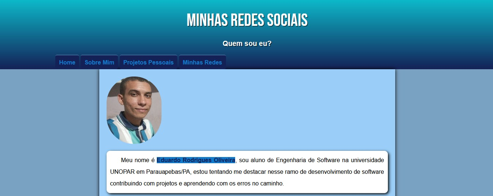
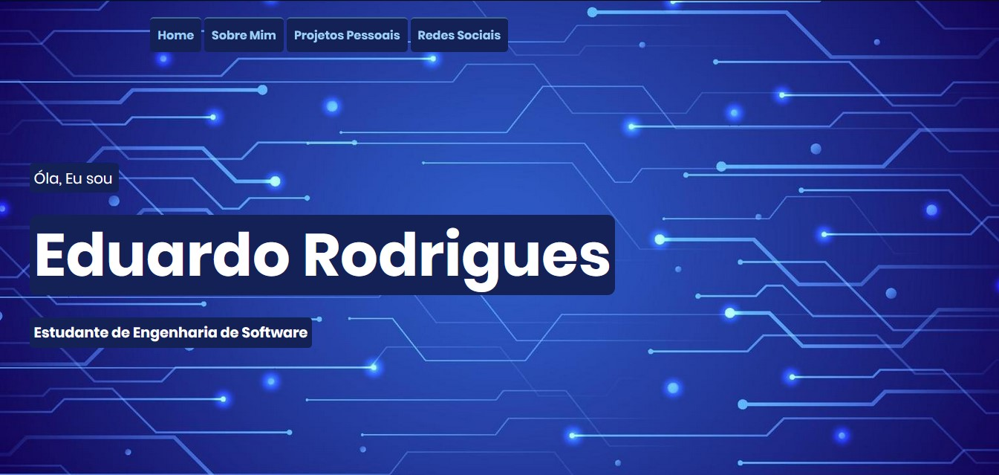

# Portfolio Versions

Este repositório contém as diferentes versões do meu portfólio online, mostrando a evolução ao longo do tempo. Abaixo estão detalhes sobre cada versão:

## Portfolio 1.0

- **Tecnologias Utilizadas:** HTML5, CSS3, JavaScript
- **Descrição:** A primeira versão do meu portfólio apresenta uma página simples com informações básicas sobre mim.
- **Link:** [Portfolio 1.0](https://eduardohro.github.io/portfolio/portfolio-1.0/)

## Portfolio 2.0

- **Tecnologias Utilizadas:** HTML5, CSS3, JavaScript
- **Descrição:** A segunda versão do meu portfólio apresenta um design mais elaborado e interativo, com seções detalhadas sobre minha experiência, habilidades e projetos.
- **Link:** [Portfolio 2.0](https://eduardohro.github.io/portfolio/portfolio-2.0/)

Sinta-se à vontade para explorar as diferentes versões do meu portfólio e acompanhar a minha evolução na área de desenvolvimento web!